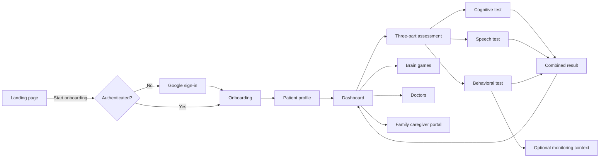
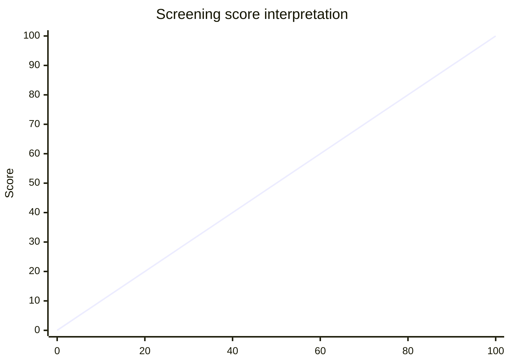
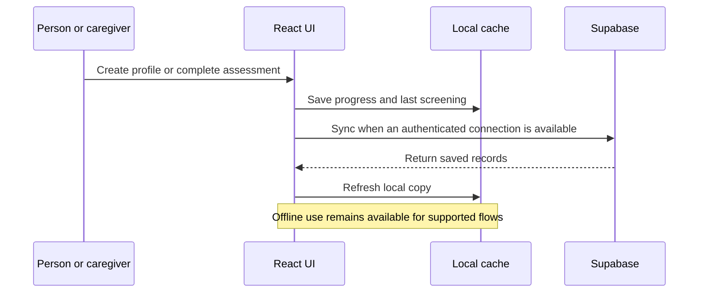
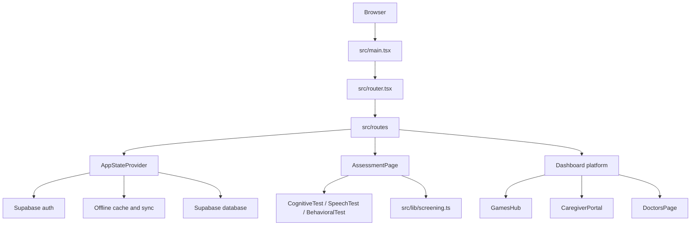

# NeuroTrack NE

> Calm, local-first cognitive screening and memory support for families and community clinics across North East India.

NeuroTrack NE is a browser-based care platform that helps a person or caregiver move from an initial conversation to a structured three-part screening, daily brain games, and practical follow-up resources. It is designed to work with weak or intermittent connectivity and to keep the experience understandable for families.

**Important:** NeuroTrack NE is a screening and education tool, not a medical diagnosis. Clinical decisions should be made with a qualified healthcare professional.

## Product Flow

The application uses a lightweight stage-based journey. Authentication is requested only when a user tries to move beyond the public landing page; the monitoring experience belongs to the assessment flow, not the authentication screen.



### Main user journey

| Stage | Purpose | Primary experience |
| --- | --- | --- |
| Landing | Explain the product and establish trust | Features, how it works, privacy, stories |
| Auth | Secure access to saved records | Google sign-in only |
| Onboarding | Create the person profile | Name, age, location, language, family contact |
| Dashboard | Choose the next action | Assessment, games, doctors, family tools |
| Assessment | Create a structured snapshot | Cognitive, speech, and behavioral tests |
| Result | Explain the screening outcome | Component scores, combined score, next steps |
| Support | Continue care between screenings | Games, caregiver tools, doctor contacts |

## Assessment Model

The assessment is intentionally split into three parts. Each completed part contributes to the combined score; the score is the rounded arithmetic mean of the available part scores.



| Score range | Tier | Product language |
| --- | --- | --- |
| `0-59` | `dementia_risk` | Elevated dementia risk |
| `60-79` | `mci` | Possible mild cognitive change |
| `80-100` | `normal` | Typical cognitive baseline |

The score is a guide for deciding what support may be useful. It must not be interpreted as a diagnosis.

## Data and Privacy Flow

NeuroTrack NE follows a local-first pattern: the interface can continue using cached patient and progress data while offline, then attempt synchronization when connectivity returns.



The client uses the public Supabase publishable key. Never put a service-role key in browser-facing environment variables.

## Features

- **Three-part screening:** cognitive, speech, and behavioral pattern tests.
- **Optional monitoring context:** surfaced with the behavioral assessment experience rather than authentication.
- **Daily brain games:** memory, attention, speech, pattern, matching, and word-fluency activities.
- **Caregiver portal:** patient selection, progress context, and emergency contact information.
- **Doctor directory:** practical follow-up contacts for North East clinics.
- **Offline-friendly behavior:** local storage and cache-first reads where supported.
- **Accessibility controls:** text scale, contrast, reduced motion, voice guidance, focus, and simplified modes.
- **Localization foundation:** English, Hindi, and Assamese support through the application i18n layer.

## Technical Overview



### Key directories

```text
src/
  components/                 Product screens and reusable UI
  components/games/           Brain game experiences
  components/layout/          Shared header and footer
  integrations/supabase/      Browser/server clients and database types
  lib/                        Scoring, offline, i18n, game progress, and app state
  routes/                     TanStack Router route components
supabase/                     Local Supabase configuration
public/                       Static files served as-is
```

## Getting Started

### Requirements

- Node.js 20 or newer
- npm or Bun
- A Supabase project for authenticated persistence

### Install

```bash
npm install
```

### Configure environment variables

Create a `.env` file in the project root:

```env
VITE_SUPABASE_URL=https://your-project.supabase.co
VITE_SUPABASE_PUBLISHABLE_KEY=your_publishable_key
```

Vite exposes only variables prefixed with `VITE_` to browser code. Do not commit `.env` or place private server credentials in it.

### Run locally

```bash
npm run dev
```

The development server prints the local URL, typically `http://localhost:5173`.

### Build and validate

```bash
npm run build
npm run lint
```

To preview the production build locally:

```bash
npm run preview
```

## Available Scripts

| Command | Description |
| --- | --- |
| `npm run dev` | Start the Vite development server |
| `npm run build` | Create a production build |
| `npm run build:dev` | Build using the development mode |
| `npm run preview` | Serve the production build locally |
| `npm run lint` | Run ESLint across the project |
| `npm run format` | Format the project with Prettier |

## Reliability Notes

- Screening and games are designed to remain useful during weak connectivity.
- Supabase persistence is best-effort; local progress remains the immediate fallback.
- OAuth requires the correct redirect URL configured in the Supabase dashboard.
- Speech scoring depends on browser speech-recognition support and permissions.
- The application should be evaluated with real clinicians and families before clinical deployment.

## License

No license has been declared for this repository yet.
